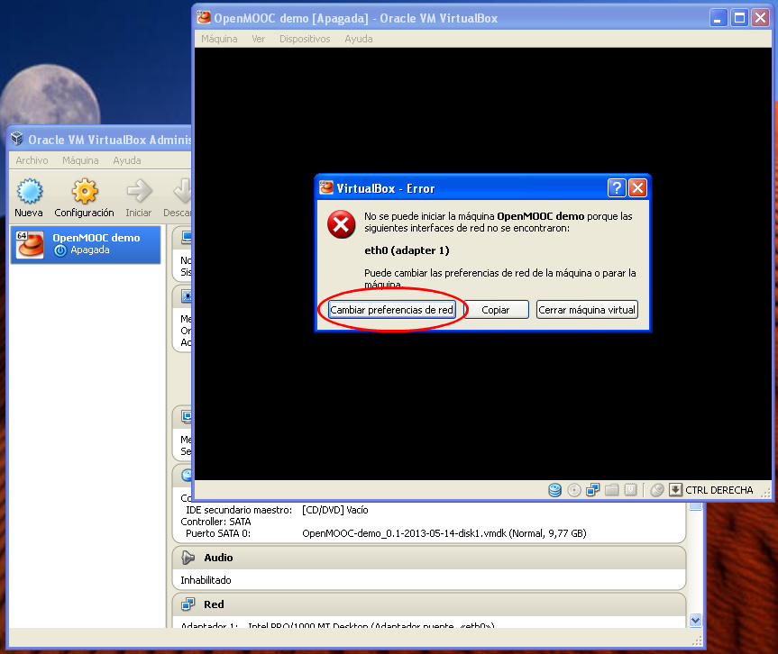
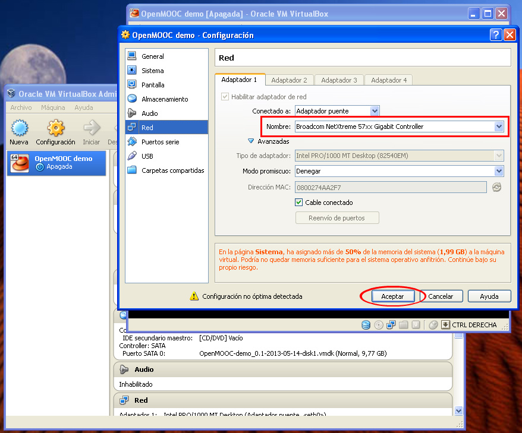

OpenMOOC Demo Appliance
=======================

The OpenMOOC Demo Appliance is the fastest and easiest way to get
running an Open MOOC System.

To run this system, your virtual machine host need a CPU and BIOS with Virtual
Extensions enabled, like VT in Intel processors or AMD-V or SMV in AMD
processors, 2 GB of ram and 10GB of free disk space.

This appliance has been tested in `VMWare Player 5 <http://www.vmware.com/products/player/>`_, `VirtualBox 4.1 <https://www.virtualbox.org/wiki/Downloads>`_ , and with the
correct settings modification can be executed in a libvirt environment.

**VMWare note:**
If you are using the VMWare virtualization environment, then you will see a
popup alert when importing the machine. VMWare complaints about the appliance
not following the OVF standars, just ignore the message and click on the
retry button.

Download the latest image
-------------------------

The latest image was published at May 14, 2013

* `OVF file <https://s3-eu-west-1.amazonaws.com/openmooc-virtual-appliances/OpenMOOC-demo_0.1-2013-05-14/OpenMOOC-demo_0.1-2013-05-14.ovf>`_
* `VMDK Image disk <https://s3-eu-west-1.amazonaws.com/openmooc-virtual-appliances/OpenMOOC-demo_0.1-2013-05-14/OpenMOOC-demo_0.1-2013-05-14-disk1.vmdk>`_

Network details
---------------

The default setted network is Bridge on eth0, you can change this to wherever
the virtual machine is accessible from your host.

The Appliance is configured by default to reconfigure all components affected
by an IP change at boot process.

To allow this, every app use an alternative port:

* Moocng: 80
* Askbot: 8080
* IDP: 8081

You can set the apache servername of the virtualhost by editing the file
`/etc/default/openmooc`, explained below.

Issues with VirtualBox in Windows
*********************************

If you are running the appliance in VirtualBox and you are using Windows, then
you will encounter a problem. The appliance tries to use a network interface
called `eth0` that is a very common interface in Unix systems.

VirtualBox will complain **when the machine boots the first time**. It will show
this error message:

Click on the "Change network preferences" button, it will open the machine's
preferences. VirtualBox will automatically fill the network adapter field
with the real one present on your Windows machine.

So, without changing anything, just click on the "Accept" button and now the
machine will have a correct network adapter, and will boot properly.

Internal Configuration details
------------------------------

The file `/etc/default/openmooc` handle the configuration of the
settings-customization process that happens at boot time.

.. code::

   # Force reconfig on every boot
   FORCE_RECONFIG=True

   # Complete this values if you want to use public domains
   # Remember to execute
   #
   # HOSTNAME_ASKBOT="questions.example.com"
   # HOSTNAME_MOOCNG="mooc.example.com"
   # HOSTNAME_IDP="idp.example.com

If you set the variable `FORCE_RECONFIG` to `False` or you leave it empty, the
reconfiguration process will only run at the first boot, and then if you have
already booted up the system, then the system will never be reconfigured.

If you want to change from IP and port to prettier values, like a domain without
ports, you must uncomment the `HOSNTAME_*` variables and execute the reconfing
command. Remember set `FORCE_RECONFIG` to `False`.

.. code:: bash

   service openmooc-config reconfig

First steps in OpenMOOC
-----------------------

The url to your OpenMOOC instance is shown when the system has booted up.

There are different users with different roles registered in your system. Note
that all users in OpenMOOC use an email as username.

A generic password has been assigned to all users: openmooc

* Students:

  * student1@example.com

  * student2@example.com

  * student3@example.com

* Teachers:

  * teacher1@example.com

  * teacher2@example.com

* Platform manager:

  * admin@example.com

As example content, there are 10 courses created.

The first course is for demo purposes. It has demo content.

The other courses are empty, but have a pre-created forum.

The courses and forums are linked by theirs urls. So remember that you can't
change the "slug" of a course if you want to mantain the link integrity
between it and its forum.

Courses and forums creation or rename
-------------------------------------

Remember that if you rename a course by changing its slug, you must login in
the operative system, change to askbot user and rename the directory course. You
can do this using the command `askbot_rename.sh`.

.. code::

   askbot_rename.sh source_slug target_slug

This script doesn't rename the database, so be careful if you create a new forum
with the same database name.

If you have created one extra course, you must create the forum manually executing
this in a ssh root session in the system:

.. code::

   askbot_create.sh new_course_slug database_name

Remember that `database_name` can only have letters and numbers.

Remember that `new_course_slug` must be exactly the course slug.

External API Keys
-----------------

OpenMOOC uses external services that need an API key to run like Google
Analytics or Amazon S3. Another services like Youtube or Vimeo don't need an API
key to run.

For *moocng*, the courses application, the important file to change these is:

`/home/moocng/moocng/moocng/local_settings.py`

Amazon S3
*********

Amazon S3 is used by peer review assignment or P2P activities. This allow to
users to attach a file like documents, spreadsheets, images...

You need to add this properties to `local_settings.py` file:

.. code::

   # Amazon credentials
   AWS_ACCESS_KEY_ID = ""
   AWS_SECRET_ACCESS_KEY = ""
   AWS_STORAGE_BUCKET_NAME = ""
   AWS_S3_UPLOAD_EXPIRE_TIME = (60 * 5) # 5 minutes

Google Analytics
****************

To get some statistics about your portal usage, you must get an Google
Analytics API Key. Then you need to append this property:

.. code::

   GOOGLE_ANALYTICS_CODE = ''

Production Details
------------------

This system is proposed for a demo environment only. This system with this
deployment isn't prepared to support a true MOOC course with millions of
users, but it works fine for at least 20 or 30 concurrent users.
